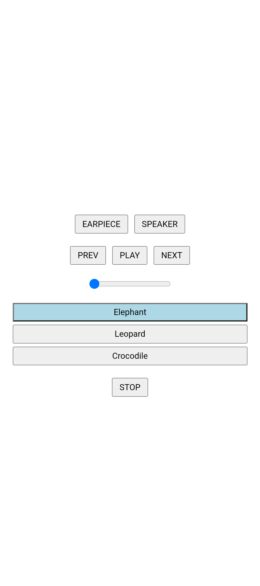
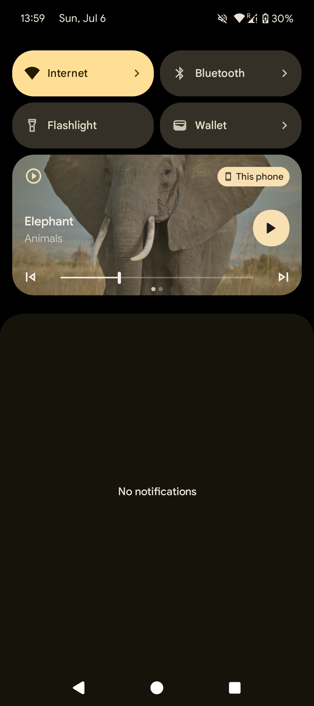

# native-audio-player

> Play native audio from a Capacitor app.

## ✨ Features

 - 🔈 Toggle between `Speaker` and `Earpiece` as audio output
 - 🎶 Audio keeps playing in the background, when app is minimized
 - 🔓 Native players in notifications and lock screens
 - 📱 Support for Android, iOS, Web (only Speaker)

## Maintainers

| Maintainer  | GitHub                                      | Social                                                          |
| ----------- | ------------------------------------------- | --------------------------------------------------------------- |
| Stefan Huber | [stefanhuber](https://github.com/stefanhuber) | [Linkedin](https://www.linkedin.com/in/stefan-huber/) |

## Install

```bash
npm install @smartcompanion/native-audio-player
npx cap sync
```

## Configuration

| Platform | Configuration |
| --- | --- |
| iOS | Audio has to be added as Background Mode within Signing & Capabilities of the app, in order to keep audio playing in the background |
| Android | The plugin has a `AndroidManifest.xml`, which includes all configurations | 

## Usage

In folder `./example` a full usage example is available. This example is also used for manual testing.

| Demo App | Native Audio Player |
|---|---|
|  |  |

## API

<docgen-index>

* [`setEarpiece()`](#setearpiece)
* [`setSpeaker()`](#setspeaker)
* [`start(...)`](#start)
* [`stop()`](#stop)
* [`play()`](#play)
* [`pause()`](#pause)
* [`select(...)`](#select)
* [`next()`](#next)
* [`previous()`](#previous)
* [`seekTo(...)`](#seekto)
* [`getDuration()`](#getduration)
* [`getPosition()`](#getposition)
* [`addListener('update', ...)`](#addlistenerupdate-)
* [Interfaces](#interfaces)

</docgen-index>

<docgen-api>
<!--Update the source file JSDoc comments and rerun docgen to update the docs below-->

### setEarpiece()

```typescript
setEarpiece() => Promise<void>
```

Set the audio output to the earpiece.

--------------------


### setSpeaker()

```typescript
setSpeaker() => Promise<void>
```

Set the audio output to the speaker.

--------------------


### start(...)

```typescript
start(options: StartOptions) => Promise<{ id: string; }>
```

Initialize the audio player with a list of audio items.

| Param         | Type                                                  | Description                                  |
| ------------- | ----------------------------------------------------- | -------------------------------------------- |
| **`options`** | <code><a href="#startoptions">StartOptions</a></code> | - The options for starting the audio player. |

**Returns:** <code>Promise&lt;{ id: string; }&gt;</code>

--------------------


### stop()

```typescript
stop() => Promise<void>
```

Stop the currently playing audio item and clear the playlist.

--------------------


### play()

```typescript
play() => Promise<void>
```

Play the currently selected audio item.

--------------------


### pause()

```typescript
pause() => Promise<void>
```

Pause the currently playing audio item.

--------------------


### select(...)

```typescript
select(options: { id: string; }) => Promise<{ id: string; }>
```

Select an audio item from the playlist by its id.

| Param         | Type                         |
| ------------- | ---------------------------- |
| **`options`** | <code>{ id: string; }</code> |

**Returns:** <code>Promise&lt;{ id: string; }&gt;</code>

--------------------


### next()

```typescript
next() => Promise<{ id: string; }>
```

Skip to the next audio item in the playlist.

**Returns:** <code>Promise&lt;{ id: string; }&gt;</code>

--------------------


### previous()

```typescript
previous() => Promise<{ id: string; }>
```

Skip to the previous audio item in the playlist.

**Returns:** <code>Promise&lt;{ id: string; }&gt;</code>

--------------------


### seekTo(...)

```typescript
seekTo(options: { position: number; }) => Promise<void>
```

Seek to a specific position in the currently playing audio item.

| Param         | Type                               |
| ------------- | ---------------------------------- |
| **`options`** | <code>{ position: number; }</code> |

--------------------


### getDuration()

```typescript
getDuration() => Promise<{ value: number; }>
```

Get the duration of the current audio item in seconds.

**Returns:** <code>Promise&lt;{ value: number; }&gt;</code>

--------------------


### getPosition()

```typescript
getPosition() => Promise<{ value: number; }>
```

Get the current position of the audio item in seconds.

**Returns:** <code>Promise&lt;{ value: number; }&gt;</code>

--------------------


### addListener('update', ...)

```typescript
addListener(eventName: 'update', listener: (result: { state: 'playing' | 'paused' | 'skip' | 'completed'; id: string; }) => void) => Promise<PluginListenerHandle>
```

Add an event listener for the update event. The listener should accept an event object
containing the current state and id of the audio item.

| Param           | Type                                                                                                     |
| --------------- | -------------------------------------------------------------------------------------------------------- |
| **`eventName`** | <code>'update'</code>                                                                                    |
| **`listener`**  | <code>(result: { state: 'playing' \| 'paused' \| 'skip' \| 'completed'; id: string; }) =&gt; void</code> |

**Returns:** <code>Promise&lt;<a href="#pluginlistenerhandle">PluginListenerHandle</a>&gt;</code>

--------------------


### Interfaces


#### StartOptions

Options for starting the audio player.

| Prop        | Type                | Description                                                  |
| ----------- | ------------------- | ------------------------------------------------------------ |
| **`items`** | <code>Item[]</code> | A list of audio items to be initialized in the audio player. |


#### Item

Represents an audio item in the playlist.

| Prop           | Type                | Description                                                                         |
| -------------- | ------------------- | ----------------------------------------------------------------------------------- |
| **`id`**       | <code>string</code> | The unique identifier for the audio item.                                           |
| **`title`**    | <code>string</code> | The title of the audio item, which is e.g. displayed in the notification player.    |
| **`subtitle`** | <code>string</code> | The subtitle of the audio item, which is e.g. displayed in the notification player. |
| **`audioUri`** | <code>string</code> | The local file URI of the audio file.                                               |
| **`imageUri`** | <code>string</code> | The local file URI of the image associated with the audio item.                     |


#### PluginListenerHandle

| Prop         | Type                                      |
| ------------ | ----------------------------------------- |
| **`remove`** | <code>() =&gt; Promise&lt;void&gt;</code> |

</docgen-api>
