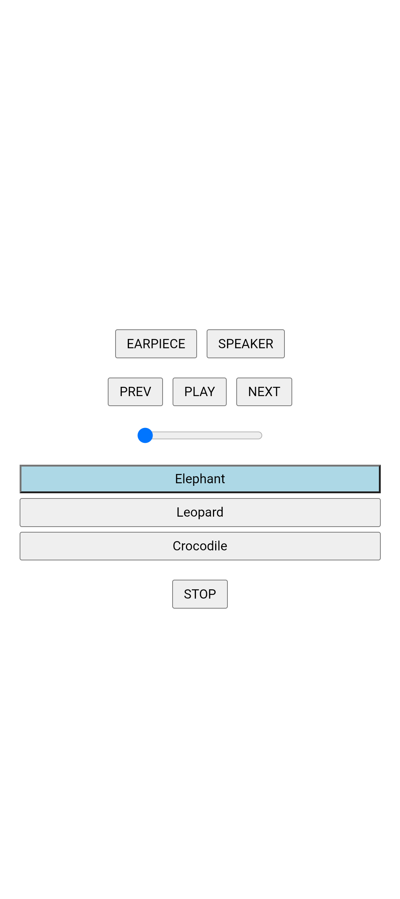
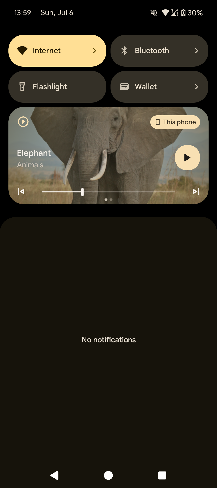

# native-audio-player

> Play native audio from a Capacitor app.

[](https://www.npmjs.com/package/@smartcompanion/native-audio-player)
[](https://github.com/smartcompanion-app/native-audio-player/actions/workflows/ci.yml)
[](LICENSE)

## ✨ Features

 - 🔈 Toggle between `Speaker` and `Earpiece` as audio output
 - 🎶 Audio keeps playing in the background, when app is minimized
 - 🔓 Native players in notifications and lock screens
 - 📱 Support for Android, iOS, Web (only Speaker)

## Maintainers

| Maintainer  | GitHub                                      | Social                                                          |
| ----------- | ------------------------------------------- | --------------------------------------------------------------- |
| Stefan Huber | [stefanhuber](https://github.com/stefanhuber) | [Linkedin](https://www.linkedin.com/in/stefan-huber/) |

## Requirements

| Requirement | Version |
| --- | --- |
| Capacitor | 8.0.0 or later |
| iOS | 15.0 or later |
| Android | API level 24 (Android 7.0) or later |

## Install

```bash
npm install @smartcompanion/native-audio-player
npx cap sync
```

## Configuration

| Platform | Configuration |
| --- | --- |
| iOS | Audio has to be added as Background Mode within Signing & Capabilities of the app, in order to keep audio playing in the background |
| Android | The plugin has a `AndroidManifest.xml`, which includes all configurations | 

## Usage

```typescript
import { NativeAudioPlayer } from '@smartcompanion/native-audio-player';

// 1. Hand over the playlist. The first item is selected and prepared,
//    but nothing plays yet — call play() when you are ready.
await NativeAudioPlayer.start({
  items: [
    {
      id: 'elephant',
      title: 'Elephant',
      subtitle: 'Animals',
      audioUri: elephantAudioUri, // local file URI, see below
      imageUri: elephantImageUri, // shown in the notification / lock screen
    },
    {
      id: 'leopard',
      title: 'Leopard',
      subtitle: 'Animals',
      audioUri: leopardAudioUri,
      imageUri: leopardImageUri,
    },
  ],
});

// 2. Follow the player state. The event fires for your own calls *and* for
//    the native notification and lock screen controls, so this is the single
//    place where your UI stays in sync.
const listener = await NativeAudioPlayer.addListener('audioPlayerChange', async ({ state, id }) => {
  switch (state) {
    case 'playing': // playback started or resumed
    case 'paused': // playback paused
    case 'skip': // another item became the current one
      break;
    case 'completed': // the item reached its end — the player stops there
      await NativeAudioPlayer.next();
      await NativeAudioPlayer.play();
      break;
  }
});

// 3. Control playback
await NativeAudioPlayer.play();
await NativeAudioPlayer.pause();
await NativeAudioPlayer.next();
await NativeAudioPlayer.previous();
await NativeAudioPlayer.select({ id: 'leopard' });
await NativeAudioPlayer.seekTo({ position: 30 }); // seconds

const { value: duration } = await NativeAudioPlayer.getDuration(); // seconds
const { value: position } = await NativeAudioPlayer.getPosition(); // seconds

// 4. Route the audio (no-op on the web)
await NativeAudioPlayer.setEarpiece();
await NativeAudioPlayer.setSpeaker();

// 'earpiece' | 'speaker' | 'external', where 'external' means headphones or a
// bluetooth device are connected and the setting above does not apply.
const { output } = await NativeAudioPlayer.getAudioOutput();

// The event covers the routes you do not control either — headphones being
// unplugged, a bluetooth device connecting. It only fires on changes, so query
// getAudioOutput() once for the initial value.
//
// Playback pauses on every one of these changes, so audio meant for the earpiece
// cannot carry on out loud somewhere else. Call play() here to keep going.
const outputListener = await NativeAudioPlayer.addListener('audioOutputChange', ({ output }) => {
  console.log(`audio now plays through the ${output}`);
});

// 5. Clean up — releases the player and removes the native player UI
await listener.remove();
await outputListener.remove();
await NativeAudioPlayer.stop();
```

### Preparing local file URIs

On Android and iOS the player reads audio and images from the device, so remote
files have to be downloaded once — for example with
[`@capacitor/filesystem`](https://capacitorjs.com/docs/apis/filesystem) into
`Directory.Data`. On the web you can pass the remote URL straight through:

```typescript
import { Capacitor } from '@capacitor/core';
import { Directory, Filesystem } from '@capacitor/filesystem';

const toLocalUri = async (url: string, filename: string): Promise<string> => {
  if (Capacitor.getPlatform() === 'web') {
    return url;
  }

  const blob = await (await fetch(url)).blob();
  const data = await new Promise<string>((resolve) => {
    const reader = new FileReader();
    reader.onload = () => resolve(reader.result as string);
    reader.readAsDataURL(blob);
  });

  await Filesystem.writeFile({ path: filename, directory: Directory.Data, data });
  return (await Filesystem.getUri({ path: filename, directory: Directory.Data })).uri;
};

const elephantAudioUri = await toLocalUri('https://example.com/elephant.mp3', 'elephant.mp3');
```

On iOS the file is looked up by its filename in the app's documents directory,
so keep the files flat in `Directory.Data` rather than in sub-folders.

### Good to know

- `start()` only prepares the playlist — playback begins with `play()`.
- The player does not advance on its own. When an item finishes you get a
  `completed` event and decide what happens next (see the example above).
- Positions and durations are whole seconds.
- `setEarpiece()` / `setSpeaker()` only override the built-in output. When
  headphones or Bluetooth are connected, that route stays untouched.

In folder `./example` a full usage example is available. This example is also used for automated and manual testing.

| Demo App | Native Audio Player |
|---|---|
|  |  |

## Other Audio Player Plugins

 - [@capacitor-community/native-audio](https://github.com/capacitor-community/native-audio)
 - [@capawesome-team/capacitor-audio-player](https://capawesome.io/plugins/audio-player/)
 - [@capgo/native-audio](https://github.com/Cap-go/capacitor-native-audio)
 - [@mediagrid/capacitor-native-audio](https://github.com/mediagrid/capacitor-native-audio)

## API

<docgen-index>

* [`setEarpiece()`](#setearpiece)
* [`setSpeaker()`](#setspeaker)
* [`start(...)`](#start)
* [`stop()`](#stop)
* [`play()`](#play)
* [`pause()`](#pause)
* [`select(...)`](#select)
* [`next()`](#next)
* [`previous()`](#previous)
* [`seekTo(...)`](#seekto)
* [`getDuration()`](#getduration)
* [`getPosition()`](#getposition)
* [`getAudioOutput()`](#getaudiooutput)
* [`addListener('audioPlayerChange', ...)`](#addlisteneraudioplayerchange-)
* [`addListener('audioOutputChange', ...)`](#addlisteneraudiooutputchange-)
* [Interfaces](#interfaces)
* [Type Aliases](#type-aliases)

</docgen-index>

<docgen-api>
<!--Update the source file JSDoc comments and rerun docgen to update the docs below-->

### setEarpiece()

```typescript
setEarpiece() => Promise<void>
```

Set the audio output to the earpiece. Has no audible effect while an external device
such as headphones or a bluetooth speaker is connected.

Playback pauses, as it does on every audio output change — see
{@link NativeAudioPlayerPlugin.addListener} for `audioOutputChange`.

--------------------


### setSpeaker()

```typescript
setSpeaker() => Promise<void>
```

Set the audio output to the speaker. Has no audible effect while an external device
such as headphones or a bluetooth speaker is connected.

Playback pauses, as it does on every audio output change — see
{@link NativeAudioPlayerPlugin.addListener} for `audioOutputChange`.

--------------------


### start(...)

```typescript
start(options: StartOptions) => Promise<{ id: string; }>
```

Initialize the audio player with a list of audio items.

| Param         | Type                                                  | Description                                  |
| ------------- | ----------------------------------------------------- | -------------------------------------------- |
| **`options`** | <code><a href="#startoptions">StartOptions</a></code> | - The options for starting the audio player. |

**Returns:** <code>Promise&lt;{ id: string; }&gt;</code>

--------------------


### stop()

```typescript
stop() => Promise<void>
```

Stop the currently playing audio item and clear the playlist.

--------------------


### play()

```typescript
play() => Promise<void>
```

Play the currently selected audio item.

--------------------


### pause()

```typescript
pause() => Promise<void>
```

Pause the currently playing audio item.

--------------------


### select(...)

```typescript
select(options: { id: string; }) => Promise<{ id: string; }>
```

Select an audio item from the playlist by its id.

| Param         | Type                         |
| ------------- | ---------------------------- |
| **`options`** | <code>{ id: string; }</code> |

**Returns:** <code>Promise&lt;{ id: string; }&gt;</code>

--------------------


### next()

```typescript
next() => Promise<{ id: string; }>
```

Skip to the next audio item in the playlist.

**Returns:** <code>Promise&lt;{ id: string; }&gt;</code>

--------------------


### previous()

```typescript
previous() => Promise<{ id: string; }>
```

Skip to the previous audio item in the playlist.

**Returns:** <code>Promise&lt;{ id: string; }&gt;</code>

--------------------


### seekTo(...)

```typescript
seekTo(options: { position: number; }) => Promise<void>
```

Seek to a specific position in the currently playing audio item.

| Param         | Type                               |
| ------------- | ---------------------------------- |
| **`options`** | <code>{ position: number; }</code> |

--------------------


### getDuration()

```typescript
getDuration() => Promise<{ value: number; }>
```

Get the duration of the current audio item in seconds.

**Returns:** <code>Promise&lt;{ value: number; }&gt;</code>

--------------------


### getPosition()

```typescript
getPosition() => Promise<{ value: number; }>
```

Get the current position of the audio item in seconds.

**Returns:** <code>Promise&lt;{ value: number; }&gt;</code>

--------------------


### getAudioOutput()

```typescript
getAudioOutput() => Promise<{ output: AudioOutput; }>
```

Get the audio output the player is currently routed to.

**Returns:** <code>Promise&lt;{ output: <a href="#audiooutput">AudioOutput</a>; }&gt;</code>

--------------------


### addListener('audioPlayerChange', ...)

```typescript
addListener(eventName: 'audioPlayerChange', listener: (result: AudioPlayerChange) => void) => Promise<PluginListenerHandle>
```

Add an event listener for player changes. The listener should accept an event object
containing the current state and id of the audio item.

| Param           | Type                                                                                 |
| --------------- | ------------------------------------------------------------------------------------ |
| **`eventName`** | <code>'audioPlayerChange'</code>                                                     |
| **`listener`**  | <code>(result: <a href="#audioplayerchange">AudioPlayerChange</a>) =&gt; void</code> |

**Returns:** <code>Promise&lt;<a href="#pluginlistenerhandle">PluginListenerHandle</a>&gt;</code>

--------------------


### addListener('audioOutputChange', ...)

```typescript
addListener(eventName: 'audioOutputChange', listener: (result: AudioOutputChange) => void) => Promise<PluginListenerHandle>
```

Add an event listener for audio output changes. Fires both when the output is changed
through {@link NativeAudioPlayerPlugin.setEarpiece} or {@link NativeAudioPlayerPlugin.setSpeaker}
and when the route changes on its own, e.g. when headphones are unplugged or a bluetooth
device connects.

Playback pauses on every one of these changes, so that audio meant for the earpiece cannot
carry on out loud through a different output. A `audioPlayerChange` event with the `paused`
state is emitted alongside this one whenever something was playing. Resuming is left to the
app: call {@link NativeAudioPlayerPlugin.play} from this listener to play on regardless.

| Param           | Type                                                                                 |
| --------------- | ------------------------------------------------------------------------------------ |
| **`eventName`** | <code>'audioOutputChange'</code>                                                     |
| **`listener`**  | <code>(result: <a href="#audiooutputchange">AudioOutputChange</a>) =&gt; void</code> |

**Returns:** <code>Promise&lt;<a href="#pluginlistenerhandle">PluginListenerHandle</a>&gt;</code>

--------------------


### Interfaces


#### StartOptions

Options for starting the audio player.

| Prop        | Type                | Description                                                  |
| ----------- | ------------------- | ------------------------------------------------------------ |
| **`items`** | <code>Item[]</code> | A list of audio items to be initialized in the audio player. |


#### Item

Represents an audio item in the playlist.

| Prop           | Type                | Description                                                                         |
| -------------- | ------------------- | ----------------------------------------------------------------------------------- |
| **`id`**       | <code>string</code> | The unique identifier for the audio item.                                           |
| **`title`**    | <code>string</code> | The title of the audio item, which is e.g. displayed in the notification player.    |
| **`subtitle`** | <code>string</code> | The subtitle of the audio item, which is e.g. displayed in the notification player. |
| **`audioUri`** | <code>string</code> | The local file URI of the audio file.                                               |
| **`imageUri`** | <code>string</code> | The local file URI of the image associated with the audio item.                     |


#### PluginListenerHandle

| Prop         | Type                                      |
| ------------ | ----------------------------------------- |
| **`remove`** | <code>() =&gt; Promise&lt;void&gt;</code> |


#### AudioPlayerChange

The payload of the `audioPlayerChange` event.

| Prop        | Type                                                          | Description                                   |
| ----------- | ------------------------------------------------------------- | --------------------------------------------- |
| **`state`** | <code><a href="#audioplayerstate">AudioPlayerState</a></code> | The playback state the player changed to.     |
| **`id`**    | <code>string</code>                                           | The id of the audio item the state refers to. |


#### AudioOutputChange

The payload of the `audioOutputChange` event.

| Prop         | Type                                                | Description                             |
| ------------ | --------------------------------------------------- | --------------------------------------- |
| **`output`** | <code><a href="#audiooutput">AudioOutput</a></code> | The audio output the player changed to. |


### Type Aliases


#### AudioOutput

The audio output the player is routed to.

`external` means the audio is not routed to the built-in earpiece or speaker, which is the
case whenever an external device such as headphones or a bluetooth speaker is connected.
The earpiece and speaker settings do not apply while an external device is in use, so
neither value would describe what is actually heard.

<code>'earpiece' | 'speaker' | 'external'</code>


#### AudioPlayerState

The playback state of the player.

<code>'playing' | 'paused' | 'skip' | 'completed'</code>

</docgen-api>
